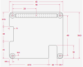

# Raspberry Pi HAT+ Template

With the relase of the Raspberry Pi 5, a new HAT form factor (HAT+) was introduced. It has cutouts for both a PCIe and two 4-lane CSI-2 camera ports.

## Template Project

Minimum KiCAD version: 7.0.10

Bottom-entry 2x20, 2.54mm SMD socket header: 
- [Samtec HLE-120-02-L-DV-BE-A-K-TR](https://www.samtec.com/products/hle-120-02-l-dv-be-a-k-tr)
- [WE 610040243021](https://www.we-online.com/en/components/products/PHD_2_54_SMT_DUAL_SOCKET_HEADER_BOTTOM_ENTRY_6100XX243021)

Extender 2x20, 2.54mm socket header: 
- [Samtec ESQ-120-14-G-D](https://www.samtec.com/standards/pc104/pc104)
- [Sparkfun PRT-16764](https://www.mouser.com/ProductDetail/SparkFun/PRT-16764?qs=W%2FMpXkg%252BdQ4FKwyaXnhaEw%3D%3D)

## Links

HAT+ spec: https://datasheets.raspberrypi.com/hat/hat-plus-specification.pdf

RPi5 mechanical drawing: https://datasheets.raspberrypi.com/rpi5/raspberry-pi-5-mechanical-drawing.pdf

HAT+ EEPROM: https://github.com/raspberrypi/utils/tree/master/eeptools

PCIe: https://datasheets.raspberrypi.com/pcie/pcie-connector-standard.pdf   
(inofficial early work: https://github.com/m1geo/Pi5_PCIe)

## Mechanical Specification

### Dimensions

Board outline:

Flexprint connector locations (with some dimensions added):

The exact center positions of the flex cables leaving the RPi5 board are needed to avoid vertical offset between connector pairs.

While mostly cosmetic for long cables which can accommodate such offsets by twisting, short cables (<= 60 mm) may end up inserted askew.

### Pinout

#### GPIO

(source: [raspberrypi.com](https://www.raspberrypi.com/documentation/computers/raspberry-pi.html))

#### CSI-2

Differential pairs are on the Pin-1 side and easily identified in context (22-pin to 15-pin flexprint adapter):

(adapted from: [thepihut](https://thepihut.com/blogs/raspberry-pi-tutorials/how-to-use-two-camera-modules-with-raspberry-pi-5))

J3, J4 markings: Pin-22 side.

Right-side contacts.

#### PCIe

Based on the image by [M1GEO] and subsequent official specification:

J20 marking: Pin-1 side.

Right-side contacts.

### Board Positions

The alignments of PCIe and CSI-2 connectors are given in the User.Drawings layer.

## License

KiCad project: copyright Helge Wurst 2024.

This source describes Open Hardware and is licensed under the CERN-OHL-S v2.

You may redistribute and modify this source and make products using it under the terms of the CERN-OHL-S v2 (https://ohwr.org/cern_ohl_s_v2.txt).

This source is distributed WITHOUT ANY EXPRESS OR IMPLIED WARRANTY, INCLUDING OF MERCHANTABILITY, SATISFACTORY QUALITY AND FITNESS FOR A PARTICULAR PURPOSE. Please see the CERN-OHL-S v2 for applicable conditions.

Source location: https://github.com/MisterHW/RPi5-HATplus

As per CERN-OHL-S v2 section 4, should You produce hardware based on this source, You must where practicable maintain the Source Location visible on the external case of the Gizmo or other products you make using this source.

## Changes

- 2024-03 initial release.